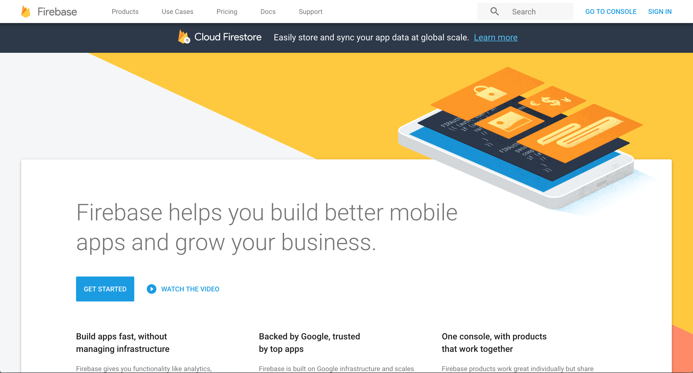
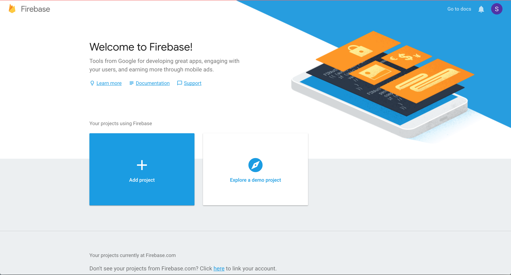
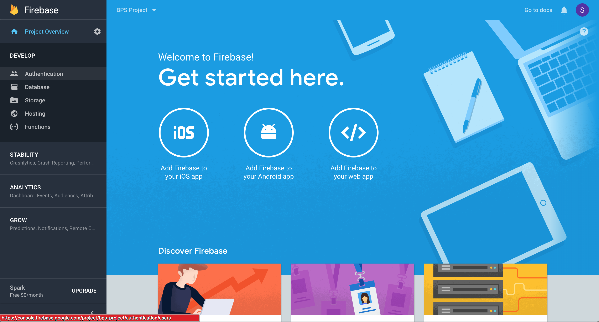
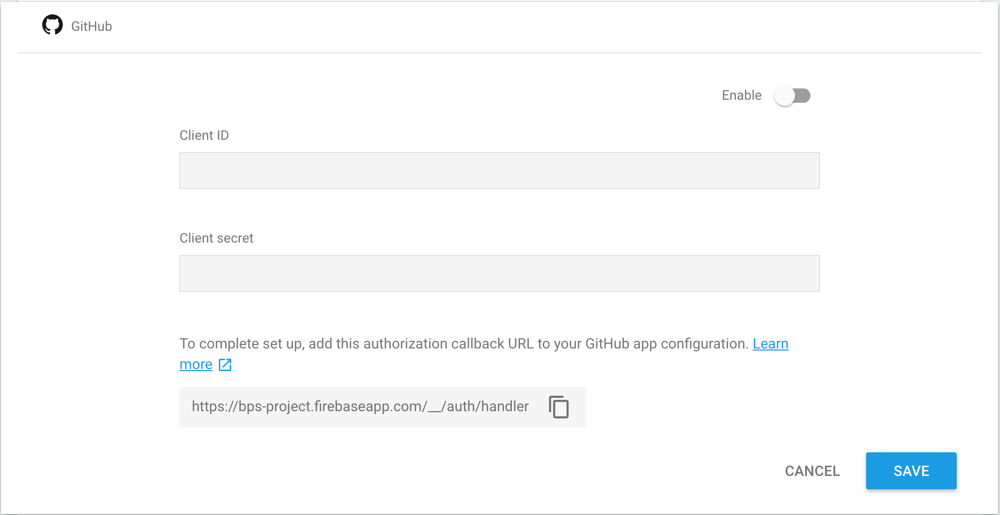
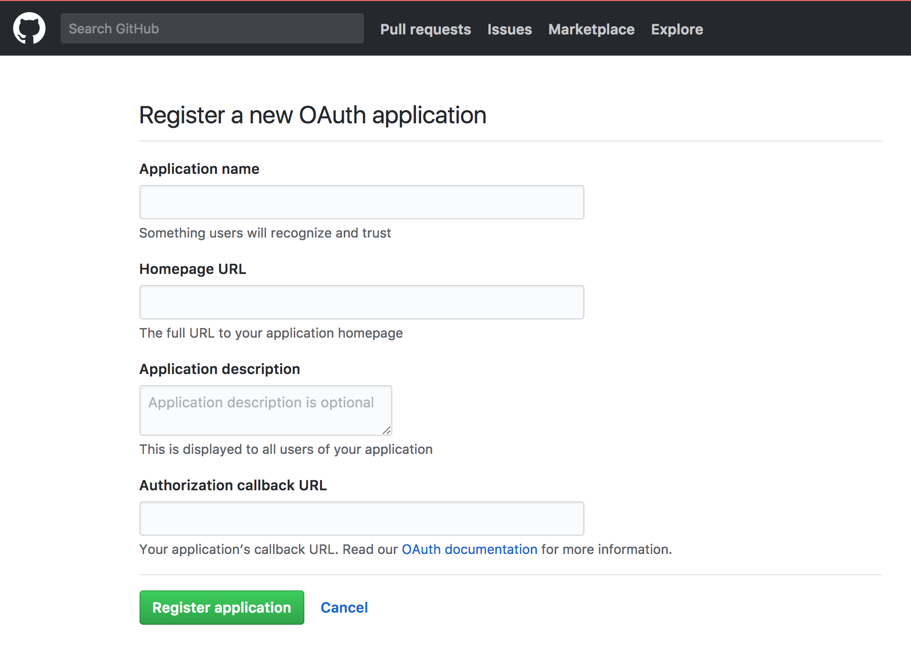
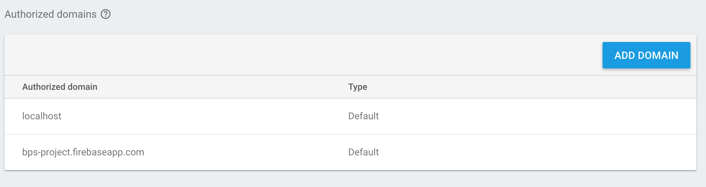
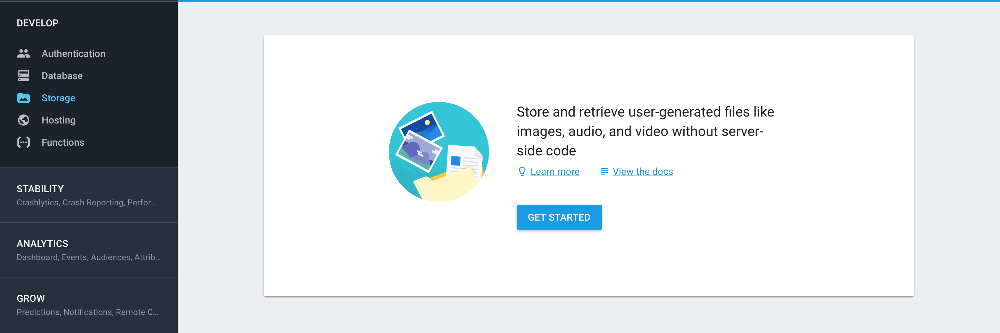
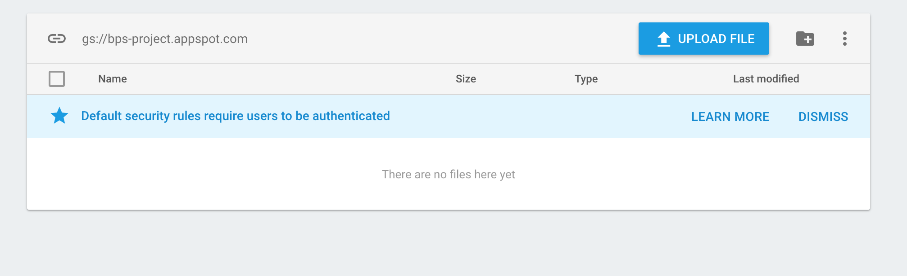

# BPS Routes Algorithm Competition

The Boston Public Schools recently organized a challenge focused on reducing the cost of running a fleet of school buses to transport students to and from school every day. While the initial contest is now over, they are interested in maintaining a continuous version of the challenge that allows anyone to submit candidate solutions for evaluation and scoring. This requires the creation of an interactive website that provides a copy of the challenge data, allows users to submit their candidate solutions, and keeps track of the best solutions on a scoreboard.

## Getting Started

These instructions will get you a copy of the project up and running on your local machine for development and testing purposes.

### Prerequisites

In order to install this web application, you will need a virtual machine (preferably a Debian and Ubuntu based linux distributions) with Node, NPM and git installed.

``` bash
# installing node
curl -sL https://deb.nodesource.com/setup_8.x | sudo -E bash -
sudo apt-get install -y nodejs

# installing npm
sudo apt-get install npm

# installing git
apt-get install git

# you will need to configure git
git config --global user.name "Foo Bar"
git config --global user.email "example@example.com"

# clone this repository
git clone https://github.com/bu-else/2017-bps-routes.git
```

In addition to setting up your server, you will need to sign up for Firebase as this is the default backend used in this application.

Navigate to https://firebase.google.com/ then click on Sign In at the top right corner. Use your Google account to sign in.


Once you're redirected to the home page, click on "Go to Console"



Click on "Add Project". You will be shown a modal asking for details about your new project. Give it a title that you can remember and recognize.



Click on the "Develop" drop-down menu on the left. Then click on "Authentication" to begin setting up the OAuth2.0 sign in methods.

This project uses GitHub to sign in users. After clicking on "Set up sign-in method", Click on GitHub under the "Sign-In Providers" header.



Firebase uses Client ID and Client Secret that GitHub provides you with in order to proxy a user's sign-in request to GitHub. Navigate to https://github.com/settings/applications/new in order to register this application. 



What you put in the "Application Name" field will be displayed to your users when they sign in so make sure that it is understandable. Under the "Authorization Callback URL", put in the callback URL that Firebase provided you with when we previously clicked on "GitHub" under the "Sign-In Providers".

Once you register your application with GitHub, GitHub will give you a ClientID and Client Secret. Copy these two credentials and paste them on the fields in Firebase under Sign-In Providers. 

Once ClientID, Client Secret are copied over to Firebase and the Callback URL is copied to GitHub, you need to click on "Enable" in the GitHub provider window on Firebase, then hit "Save" to fully enable the sign in method.

**Note :** We are using GitHub in this application but if you would like to add other social applications in order to sign in users, simply repeat the above steps for other providers.

Firebase automatically adds 2 domains to your authorized domains. If you are deploying this application, you will need to add your IP/domain. For security purposes, OAuth workflows will only work with authorized domain names. For instance, if you try to run this application by accessing 128.0.0.1:3000, you will not be able to sign in since it is not yet in the authorized domains list.


Once you have set up your authentication workflow on Firebase, click on the "Develop" tab on the left side of the console once again and this time open the "Storage" tab.



Click on "Get Started" and this will bring up a pop-up window letting you know that all the files stored on Firebase will have all reads and write rules. This means that users will be able to read and write without any specific permissions. Click on "Got It" to remove the pop-up window. 



Once you are navigated to the window above, you will be able to see your storage bucket. In our example it is "gs://bps-project.appspot.com". Take a note of this since you will need it later when you configure your application.

Your setup is now complete and you can begin installing the application.

### Installing

**Note :** Please ensure that you have completed the Prerequisites above. 

Once you have cloned this repository, go into the project directory and begin installing all the required modules.
``` bash
cd 2017-bps-routes
npm install
```

Once the modules are installed, navigate to /public/scripts/signin.js and change the credential in the config object

``` javascript
// Initialize Firebase
const config = {
    apiKey: "YOUR CLIENT KEY FROM FIREBASE",
    authDomain: "<YOUR PROJECT ID>.firebaseapp.com",
    databaseURL: "<YOUR DATABASE URL>", // Optional
    projectId: "<YOUR PROJECT ID>",
    storageBucket: "<YOUR STORAGE BUCKET URL>",
};
firebase.initializeApp(config);
```

To run the application go to your project root directory and run this command
``` bash
npm start
```

## Built With

* [Express](https://expressjs.com/) - The web framework used
* [Firebase](https://firebase.google.com/) - Database and file storage
* [Pug](https://pugjs.org/) - Templating Engine